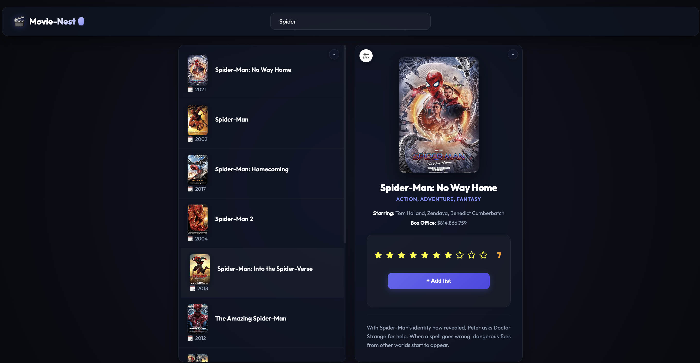
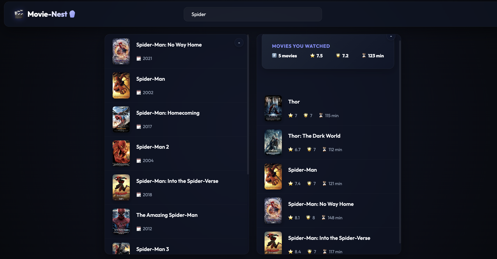

# 🎬 Movie-Nest 🍿

A sleek, premium, cinematic web dashboard built with React and Vanilla CSS. **Movie-Nest** allows users to search for movies in real-time using the OMDb API, rate them with an interactive star rating panel, and curate a glassmorphic watchlist with auto-calculating review metrics.

---

## 📸 Screenshots

| Search & Watchlist Dashboard | Movie Details & Interactive Ratings |
| :---: | :---: |
|  |  |

---

## ✨ Features

- **Live OMDb Search**: Instantly query thousands of titles directly from the OMDb API database.
- **Cinematic Dark Theme**: Fully custom vanilla CSS styles utilizing Outfit typography, deep shadows, and subtle neon glows for an immersive movie theater feel.
- **Glassmorphic Components**: Sleek translucent containers utilizing `backdrop-filter` to display content layered on top of dynamic gradients.
- **Interactive Star Rating**: Select ratings from 1 to 10 with custom hover scale transitions.
- **Smart Duplicate Prevention**: Prevents adding the same movie twice. Previously watched items display a custom status label showing your rating instead of the star rating container.
- **Real-Time Watchlist Statistics**: Auto-calculates your watched count, average IMDb rating, average user rating, and total running runtime.

---

## 🛠️ Tech Stack

- **Frontend Core**: React 19.x (Hooks: `useState`, `useEffect`)
- **Styling**: Vanilla CSS (CSS Custom Variables, Flexbox, Grid, Glassmorphism, Micro-animations)
- **API**: [OMDb API](http://www.omdbapi.com/) for movie metadata retrieval

---

## 🚀 Getting Started

### 📋 Prerequisites

Ensure you have [Node.js](https://nodejs.org/) installed on your machine.

### 📥 Installation

1. Clone or download the repository to your local machine.
2. Open your terminal in the root directory of `movie-nest` and install dependencies:
   ```bash
   npm install
   ```

### 🔑 API Key Configuration

The project utilizes an OMDb API key inside `src/App.js` to fetch movie information. By default, it uses a pre-configured key:
```javascript
const key = '2d9e86a4';
```
If you wish to configure your own key, visit [OMDb API Keys](http://www.omdbapi.com/apikey.aspx) and replace the variable in `src/App.js`.

### 💻 Running Locally

To start the local development server, run:
```bash
npm start
```
This runs the app in development mode and opens it automatically at [http://localhost:3000](http://localhost:3000). The page will hot-reload if you modify any code or styling.

### 📦 Production Build

To build the application for production, compile the optimized assets inside the `build` folder:
```bash
npm run build
```

---

## 📂 Project Architecture

- **`src/App.js`**: Core React component tree managing states (`movies`, `watched`, `query`, `selectedMovieId`, `movieDetails`, `isLoading`, `error`) and logic.
- **`src/index.css`**: Complete vanilla CSS styling containing styling variables, design system rules, layouts, card hovers, and flexbox structural order for the details card.
- **`src/index.js`**: Entry point bootstrapping the React tree into the DOM.
- **`public/index.html`**: Host HTML page setting viewport metadata and loading custom fonts.
